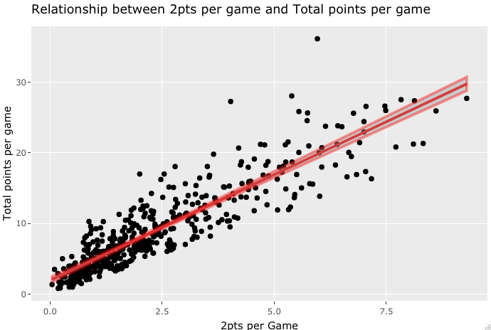
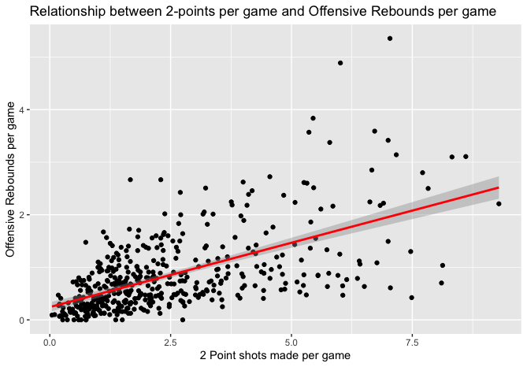

```{r setup, include=FALSE}
knitr::opts_chunk$set(echo = TRUE, error = TRUE, message = FALSE)
```

## 1. Introduction 
This reproducible data analysis project is focusing on developing a starting line up for the Chicago Bulls, a team competing in the National Basketball League. In season 2018-19 the Bulls finished 27th in the league (out of 30 teams) and the general manager has asked for an analysis to scout the league and find a new potential starting five players for the up coming season with a budget of $118 million (ranked 26th out of the 30 teams).

As the data analyst for the Chicago Bulls a basketball team in the National Basketball Assosociation (NBA) I have been put in charge of analysising season 2018-2019 data to find a ideal effective starting 5. Within season 2018-2019 the Bulls place 27th out of 30 with a win loss record of 22 and 60 respectively. The budget the Bulls have for the upcoming season is \$118 million, ranked 26th out of 30. For reference, the team with the highest budget is the Portland Trailbalzers (\$148 million) and the best performing team from the 2018-2019 season the Milwaukee Bucks ($131 million).

The General Manager of the Bulls has tasked me to find the best available starting 5 players (one from each position. It also has to be mentioned that there must still be remaining money to fill the remaining team roster.

In basketball each position play different role on court and therefore it is important to analysis the key metrics that are specific to the position. It is known that we are on the hunt for the best five players suited for the team. The key positional metrics that will be focusing on each position are:
   
  - *Point Guards (PG)* - Point Guards are considered the best ball handler and passer of the team. There ability to locate there teammates or take a high percentage shot is important also. Therefore key variables in finding a good starting point guard include; high number of assists, low number of turnovers and good shooting statistics. (1)
         
  - *Shooting Guard (SG)* - Shooting Guards can play a number of roles including shooting 3pts, 2pts and getting to the line for free throws. The shooting guard tends to take most of the shots in a team, however can also help get team mates into the game with passing and assists. A possible metric to rank these players by is an assist to turnover ratio.  (1)
         
  - *Small Forwards (SF)* - Small Forwards play a versatile role on the court, with the main metrics associated with them being Rebounds, 2pts and 3pts scored. (1)

  - *Power Forwards (PF)* - Power Forwards are powerful taller players that tend to score close in to the basket. The key statistics for this position is rebounds, score per game. A important metric to investigate further is looking at second chance points which are offensive rebounds leading to points scored. (1)
         
   - *Centre (C)* - Centres are usually the tallest player on the court and tend to spend most of the game close to the ring. These players key statistics include blocks, rebounds and points.(1)

With the ultimate goal of the Chicago Bulls to increase its ranking and make a run at a Championship it is important that this process ultimately focuses on maximising the amount of points scored by the team whilst also minimising the number of oppotunites the opposition team get.To be able to determine the best starting five players for the upcoming season there was a number of steps required before analysis can occur.

## 2. Reading and tidying the data
   
```{r}
library(tidyverse)
library(broom)
``` 

This is a important first step of data analysis. All the data being used within the analysis was processed to ensure that each variable had a separate column, each observation observed was on a separate row, each value was within a cell and all missing data was removed. The data was sourced from [this link](https://unicanberra.instructure.com/courses/9531/pages/data-description-reproducible-data-analysis-project). 

```{r, include=FALSE, message=FALSE}
setwd("~/Assessment-4/Assessment-4-Reproducible-Data-Analysis-Project")

#Load the data into the project 

salaries <- read.csv("data/raw_data/2018-19_nba_player-salaries.csv")
statistics <- read.csv("data/raw_data/2018-19_nba_player-statistics.csv")
team_statistics_1 <- read_csv("data/raw_data/2018-19_nba_team-statistics_1.csv")
team_statistics_2 <- read_csv("data/raw_data/2018-19_nba_team-statistics_2.csv")
payroll <- read.csv("data/raw_data/2019-20_nba_team-payroll.csv")
```

Once the data has been read in it is time to clean up the statistics. Starting with the team data. 

```{r}
# Tidying the team data provided. Some of the team statistics names contain illegal variable names (e.g. number or "%"). 
team_statistics_1 <- team_statistics_1 %>%
  rename(Rk = 'Rk', 
         eFG. = 'eFG%',
         TOVp = 'TOV%',
         ORBp = 'ORB%',
         DRBp = 'DRB%')

team_statistics_1[,c("X","X.1","X.2")] <- list(NULL) 
# This step drops the blank variables at the end of the dataset

team_statistics <- bind_cols(team_statistics_2, team_statistics_1[c(4:5)]) 
# This step combines the teams data and there overall win lose record                                  

team_statistics <- team_statistics %>% 
  rename(FGp = 'FG%',
         X3Pp = '3P%',
         X2Pp = '2P%',
         FTp = 'FT%') %>%
  mutate(ASTTOVR = (AST/TOV)) %>%
  select(Rk:Team, G, W:L, FG:PTS, ASTTOVR)
```

Once the data for teams has been filtered, its onto the players data and salaries.

```{r}
# Tidying the individual players data provided 
statistics <- rename(statistics, 
                     FGp = 'FG.',
                     X3Pp = 'X3P.',
                     X2Pp = 'X2P.',
                     eFGp = 'eFG.',
                     FTp = 'FT.',
                     Player = 'player_name')

salaries <- salaries %>%
  rename(Player = 'player_name', 
         Salary = 'salary') %>%
  select(Player:Salary)

salaries[,c("X", "X.1", "X.2", "X.3")] <- list(NULL) 
# This step drops the blank variables at the end of the dataset

statistics <- filter(statistics, Tm != "TOT") 
# This step removes when Tm = TOT, because it means total for players that are in more then 1 team 

statistics <- data.frame(stringsAsFactors = FALSE, statistics)
```

During the season players can play for a number of different clubs. The data set contains the same players playing for multiple teams and positions. This step combines those players statistics. 

```{r}
statistics <- statistics %>%        
  group_by(Player, Age) %>% 
  summarise(Pos = paste(Pos, collapse = ", "),
            Tm = paste(Tm, collapse = ", "),
            G = sum(G), 
            GS = sum(GS),
            MP = sum(MP), 
            FG = sum(FG),
            FGA = sum(FGA),
            FGp = (FG/FGA), 
            X3P = sum (X3P),
            X3PA = sum(X3PA), 
            X3Pp = (X3P/X3PA),
            X2P = sum(X2P),
            X2PA = sum(X2PA), 
            X2Pp = (X2P/X2PA), 
            FT = sum(FT),
            FTA = sum(FTA),
            FTp = (FT/FTA),
            ORB = sum(ORB), 
            DRB = sum(DRB), 
            TRB = sum(TRB), 
            AST = sum(AST), 
            STL = sum(STL), 
            BLK = sum(BLK), 
            TOV = sum(TOV), 
            PF = sum(PF), 
            PTS = sum(PTS),
            FTF = (FTA/FGA), 
            PTS_per_game = (PTS / G), 
            PTS_per_min = (PTS/MP),
            ASTTOVR = (AST/TOV))

statistics <- full_join(x = statistics, y = salaries) %>%
  drop_na()

player_statistics <- statistics
```

From here the raw data is processed and read for analysis.

```{r}
write_csv(player_statistics, file = "data/processed_data/player_statistics.csv")
write_csv(team_statistics, file = "data/processed_data/team_statistics.csv")
```

## Exploratory Analysis 

```{r}
player_statistics <- read_csv("data/processed_data/player_statistics.csv")
team_statistics <- read_csv("data/processed_data/team_statistics.csv")
```

From here the data is checked and the relationships between variables and additional variables are added ready for further analysis. 

In this section the players positions will be broken down and key statistics per position will be analysed.

## Point Guards (PG)
```{r, warning=FALSE}
point_guards_data <- player_statistics %>%
  select(Player:G,
         MP,
         FGA,
         FTA,
         AST, 
         TOV, 
         PTS,
         PTS_per_game,
         Salary) %>% 
  filter(Pos == "PG") %>% 
  mutate(ASTTOVR = (AST/TOV)) 
```
Creating a Assist to turnover variable. This will give a good understanding of how well the PG is able to get the ball to teamates without turning it over.

```{r, warning=FALSE}
point_guards_data <- point_guards_data[is.finite(point_guards_data$ASTTOVR),]  
# removes any data that contains an infinite value. e.g. Scott Machado

point_guards_data <- point_guards_data %>%
  mutate(mean_ASTTOVR = mean(ASTTOVR))

point_guards_data <- point_guards_data %>%
  mutate(ASTTOVR_rating = if_else(condition = ASTTOVR < mean_ASTTOVR, 
                           true = "below average", false = "above average"))
point_guards_data <- point_guards_data %>%
  mutate_at(vars(PTS_per_game, ASTTOVR, mean_ASTTOVR), funs(round(., 3)))
```

Next is the Shooting Guards:
```{r, warning=FALSE}
shooting_guard_data <- player_statistics %>%
  select(Player:G,
         MP,
         FG: X2Pp,
         FT:FTp,
         AST,
         ORB:TRB,
         PTS, 
         Salary) %>%
  filter(Pos %in% c("SG", "SF, SG")) %>%
 mutate(PTS_per_game = (PTS/G), FT_per_game = FT/G)
shooting_guard_data <- shooting_guard_data %>%
  mutate_at(vars(FGp, X2Pp,X3Pp, FTp, PTS_per_game,FT_per_game), funs(round(., 3)))
```

Small Forwards:
```{r, warning=FALSE}
small_forward_data <- player_statistics %>%
  select(Player:G,
         MP,
         FG: X2Pp,
         FT:FTp,
         AST,
         ORB:TRB,
         PTS, 
         Salary) %>%
         filter(Pos %in% c("SF", "SF, SG", "PF, SF")) %>%
  mutate(PTS_per_game = (PTS/G), 
         AST_per_game = (AST/G),)
small_forward_data <- small_forward_data %>%
  mutate_at(vars(FGp, X2Pp,X3Pp, FTp, PTS_per_game,AST_per_game), funs(round(., 3)))
```
Power Forwards:
```{r}
power_forward_data <- player_statistics %>%
  select(Player:G, 
         MP,
         FG:FGp,
         X2P:FTp,
         ORB:TRB, 
         PTS,
         PTS_per_game, 
         Salary) %>%
  filter(Pos %in% c("PF", "PF, SF", "PF, SG", "C,PF")) %>%
  mutate(TRB_per_game = TRB/G, 
         ORB_per_game = ORB/G)

power_forward_data <- power_forward_data %>%
mutate_at(vars(FGp,PTS_per_game, X2Pp, FTp, TRB_per_game,ORB_per_game), funs(round(., 3)))
```

Centre:
```{r}
centre_data <- player_statistics %>%
  select(Player:G,
         MP:FGp,
         X2P:FTp,
         ORB:TRB, 
         BLK, 
         PTS,
         PTS_per_game, 
         Salary) %>%
  filter(Pos %in% c("C", "C, PF")) %>%
  mutate(TRB_per_game = TRB/G, 
         ORB_per_game = ORB/G, 
         BLK_per_game = BLK/G)
centre_data <- centre_data %>% 
  mutate_at(vars(FGp, X2Pp,FTp, PTS_per_game, TRB_per_game,ORB_per_game, BLK_per_game), funs(round(., 3)))
```


## 4. Data modelling and results 
Once the key statistics per position were identified it was then time to determine relationships between the metrics and to see if they are eligible for further analysis. For the most part the variables are compared to points per game as this at the end of the day is the most important factor in the game of basketball. To win a game the team must have more points then the opposition. 

For the point guards and shooting guards the relationship between Assist to Turnover Ratio (ASTTOVR) and Points per game was analyzed.

<center>

{width=60%}
</center>

As shown in the graph, there is an upward trend between ASTTOVR and points scored per game which indicates that the more assists and fewer turnovers per game leads to more points scored. So the ideal point and shooting guards will have a high ASTTOVR value. 

Further to this it was important to determine what scoring statistics should be used to rank the players by. The two main types of scoring analysed was 2 point and 3 point shots. To do this a Multi-linear regression was generated to compare the two types of feild goals scored per game. 

```{r}
scoring <- player_statistics %>%
  select(Player:G, FG, FGp, X2P, X2Pp, X3P, X3Pp, PTS_per_game) %>%
  mutate(FG_per_game = (FG/G),
         X3P_per_game = (X3P/G),
         X2P_per_game = (X2P/G), 
         PTS_per_game) %>%
  mutate_at(vars(FG_per_game, X2P_per_game, X3P_per_game), funs(round(., 3)))

scoring_data <- select(scoring,
                       PTS_per_game, 
                       X2P_per_game, 
                       X3P_per_game)
```

<center>

 {width=60%}
</center>
These graphs show the relationships between two and three point shots made and total points. It can be seen in the Multilinear Regression graph that 2 point shots have a stronger relationship with total points which can be shown in the second graph. 
```{r, include=TRUE}
fit <- lm(PTS_per_game ~ X2P_per_game + X3P_per_game, data = scoring_data)
broom::tidy(fit, conf.int = TRUE) #Test for multi-Linear Regression

car::vif(fit)
```

The findings show that the X2P_per_game is the more effective mode of scoring 

```{r, include=TRUE, warning=FALSE}
std_res <- rstandard(fit)
points <- 1:length(std_res)

scoringplot <- ggplot(data= NULL, aes(x = points, y = std_res)) +
  geom_point()+
  ylim(c(-5,5)) +
  geom_smooth(method = "lm", colour = "red")

res_labels <- if_else(abs(std_res) >= 2.5, paste(points), "")

scoringplot + geom_text(aes(label = res_labels), nudge_x = 0.5, nudge_y = 0.5) 
# visulasing the outliters

hats <- hatvalues(fit)
hat_labels <- if_else(hats >= 0.025, paste(points), "")

ggplot(data = NULL, aes(x = points, y = hats)) +
  geom_point()+
  geom_text(aes(label = hat_labels), nudge_x = 20) #Leverage Points

scoringplot + 
  geom_text(aes(label = hat_labels), nudge_x = 0.05)

cook <- cooks.distance(fit)
cook_labels <- if_else(cook >= 0.15, paste(points), "")

ggplot(data = NULL, aes(x = points, y = cook)) + 
  geom_point() +
  geom_text(aes(label = cook_labels), nudge_y = 0.05)

scoringplot +
  geom_text(aes(label = cook_labels), nudge_y = 1)

res <- residuals(fit)
fitted <- predict(fit)

ggplot(data = NULL, aes(x = fitted, y = res)) + 
  geom_point(colour = "black") + 
  geom_smooth(se = FALSE, colour = "red")
```
The steps taken above is to ensure that the relationship between 2 point shots and total points scored pass all the assumptions required. As it can be seen the test does pass and there is a linear relationship between the two variables. 

The final metric analysed was the relationship between rebounds, specifically offensive rebounds and 2 point shots made. Offensive rebounds was chosen as this looks at players ability to get second chance points, whereby a team mate may have shot the ball and missed and they have got the rebound and taken another shot. 

```{r, include=TRUE, warning=FALSE}

Reb_to_score <- player_statistics %>%
  select(Player:G, FG, FGp, X2P, X2Pp, X3P, X3Pp, ORB:TRB, PTS) %>%
  mutate(RB_per_game = (TRB/G),
        X2P_per_game = (X2P/G),
        PTS_per_game = (PTS/G)) 

REB_MLR_dat <- select(Reb_to_score,
                     PTS_per_game, 
                     X2P_per_game, 
                     RB_per_game)

```
<center>
{width=60%}
</center>
```{r, include=TRUE, warning=FALSE}
Reb_fit <- lm(X2P_per_game ~ RB_per_game, data =  Reb_to_score)
broom::tidy(Reb_fit, conf.int= TRUE)

Reb_plot <- ggplot(Reb_to_score, aes(x = X2P_per_game, y = RB_per_game)) + 
  geom_point(colour = "black") +
  geom_smooth(method = "lm", colour = "red")

Reb_std_res <- rstandard(Reb_fit)       #Step to detect outliers
Reb_points <- 1:length(Reb_std_res)
Reb_res_labels <- if_else(abs(Reb_std_res) >= 2.5, paste(Reb_points), "")

ggplot(data = NULL, aes(x = Reb_points, y = Reb_std_res)) +
  geom_point() +
  geom_text(aes(label = Reb_res_labels), nudge_x = 25) + ylim(c(-4,4)) +
  geom_hline(yintercept = c(-3,3), colour = "red", linetype = "dashed")

Reb_plot +
 geom_text(aes(label = Reb_res_labels), nudge_x = 0.8)

Reb_hats <- hatvalues(Reb_fit)
Reb_hats_labels <- if_else(Reb_hats >= 0.02, paste(Reb_points), "")

#Checking for Leverage points
ggplot(data = NULL, aes(x = Reb_points, y = Reb_hats)) +  
  geom_point() +
  geom_text(aes(label = Reb_hats_labels), nudge_y = 0.001)

#Checking for Leverage points
Reb_plot +
  geom_text(aes(label = Reb_hats_labels), nudge_x = -0.8) 

Reb_cook <- cooks.distance(Reb_fit)
Reb_cook_labels <- if_else(Reb_cook >= 0.025, paste(Reb_points), "") 

#Checking for Influence
ggplot(data = NULL, aes(x = Reb_points, y = Reb_cook)) +   
  geom_point() +
  geom_text(aes(label = Reb_cook_labels), nudge_y = 0.003)

Reb_plot +
  geom_text(aes(label = Reb_cook_labels), nudge_x = 0.5)

Reb_res <- residuals(Reb_fit)
Reb_fitted <- predict(Reb_fit)

ggplot(data = NULL, aes(x = Reb_fitted, y = Reb_res)) + 
  geom_point(colour = "black") +
    geom_smooth(se = FALSE, colour = "red")
```

The graph shows that as the number of offensive rebounds increase, so does the number of 2 point shot made. The ability for a player to get an offensive rebound and then score from that is important for aspect of Centres and Power Forwards. 

# Player Recommendations

After filtering and tidying the data, the next step is to decide who will be the optimal starting five for the upcoming season. Based on the statistics provided and the key statistics measured the starting five was decided:

*Point Guard - Monte Morris*


After filtering the data based on the ASTTOVR ratio the player that rated highest was *Tyus Jones*, however after analysising the other important statistics *Monte Morris* was the Point Guard of choice. Morris ranked second in the ASTTOVR rankings *(5.712)* and third in points scored per game *(10.378)* Based on the selected key statistics for the point guard role Morris is a very strong candidate as he excels in being able to run the court, getting teammates involved with great accuracy and minimal turnovers as well as being able to score himself when he has an open shot. With a price tag of only *$1,349,383* and only 23 years old the potential upside in investing in Monte Morris as the lead Point Guard can have benefits for many years to come.

*Shooting Guard - Devin Booker*


The Shooting Guard plays the most versatile role within the team as they are able to score from all ranges as well as getting the ball to teammates in good positions. The key metric that was focused on was the points scored per game and when filtered by the highest points per game *Devin Booker* stood out average *26.562* points per game. *Devin Booker* also was ranked top 4 Shooting Guards in regards to number of assists in the season with *433*. *Devin Booker's* salary is very reasonable for his price tag being *$3,314,365* which in comparison to other top points per game scores is very favorable being one of the lowest paid in the top 10. 

*Small Forward - Nicolas Batum*


Small forwards need to have all-round ability and can play a number of important roles on the court. The main metrics focused on is scoring, assists and rebounds. When focusing on number of assists per game *Nicolas Batum* ranked highest in this statistic *(3.293)*. Nicolas Batum also ranks second in points per game *(9.320)* which is another key statistics for his position. Nicolas Batum's salary is *$24,000,000* but considering he is in the two players for assists and points score per game for his position he will be a good addition to the team.

*Power Forward - PJ Tucker*


Power Forwards are important role players on both the defensive and offensive end. A key metric used to rank the Power Forwards is Offensive Rebounds to 2 points scored (2 points used as determined by the analysis above). This metric allows second chance points to be calculated as the player is able to rebound a team mates shot and then go on to score from it. From looking at the data *PJ Tucker* was the best all round player for the position. Tucker ranked second in Offensive Rebounds to 2 points scored *(1.983607)* but had more points per game on average *(7.329)*. PJ Tucker also ranked highest in total rebounds per game which means he is able to get rebounds on both the defensive and offensive end. PJ Tucker has a salary of *$7,959,537* and will have an immediate impact in both the offensive and defensive end.  

*Centre - Andre Drummond*

The final position to be selected is the centre. The centres role is to protect the basket and score close in. The key statistics for the centre includes, rebounds, blocks and 2 point shots made. Andre Drummond was a clear choice when it came to the number of rebounds per game *(15.594937)*, second in Blocks per game *(1.7468354)* and leads the points per game for position. Andre Drummond has a salary of *$25,434,262* however is very strong at the defensive and offensive ends and will be a great addition to the line up. 

# Summary
To conclude,the starting lineup that is recommended is as follows:

  - Point Guard: Monte Morris - $1,349,383
  - Shooting Guard: Devin Booker - $3,314,365
  - Small Forward: Nicolas Batum - $24,000,000
  - Power Forward: PJ Tucker - $7,959,537
  - Centre: Andre Drummond - $25,434,262

The total cost of the starting line up is \$62,057,547 leaving a remaining budget of \$55,942,453 for the bench players. With there being 10 bench players the average cost for each player being approximately \$5,594,245. From the analysis completed there was a number of potential candidets that can be used as bench players. These players can be selected in the same method as the starting five.   


#### Refrence List:
1. Kingaroy Basketball. Basketball positions [Internet]. Kingaroy: Kingaroy Amateur Basketball Association;
n.d. [cited 2021 May 1]. Available from: https://websites.sportstg.com/get_file.cgi?id=36250836 
2.  University of Canberra Website [internet]. Canberra: University of Canberra; 2021. Data Description - Reproducible Data Analysis Project; c2021 [cited 2021 May 1]. Available from: https://unicanberra.instructure.com/courses/9531/pages/data-description-reproducible-data-analysis-project


